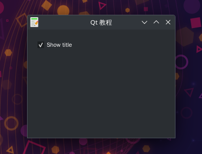
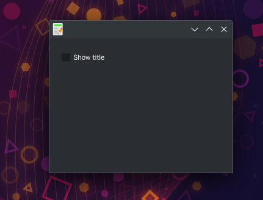

# 复选框控件QCheckBox
- QCheckBox复选框控件，它有两个状态:打开和关闭，他是一个带有文本标签（Label）的控件。
- 复选框常用于表示程序中可以启用或禁用的功能。
- 在我们的示例中,我们将创建一个复选框,将切换窗口标题。

## 控件介绍
- 控件是构建应用程序的基本模块，Qt5提供各种各样的控件；
- 包括按钮、复选框、滑动条、列表框等；
- 常用的控件:
    - QCheckBox,ToggleButton,QSlider,QProgressBar,QCalendarWidget
    - QPixmap、QLineEdit QSplitter,QComboBox

## 效果展示

