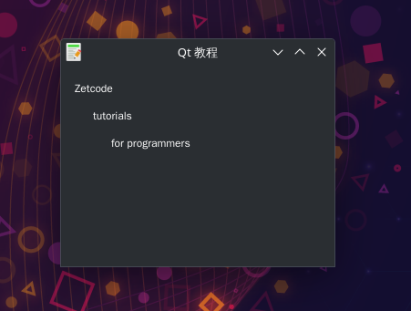

# 布局-绝对位置定位
本节开始学习一些布局管理。  
创建一些标签，按绝对位置进行摆放。

## Qt 布局有两种方式
- 绝对位置定位
- 布局管理器

## 绝对定位介绍
- 绝对定位:程序指定每个控件的位置和大小(以像素为单位)。
- 绝对定位有以下限制:
  - 如果我们调整窗口，控件的大小和位置不会改变；
  - 在各种平台上应用程序看起来会不一样；
  - 如果改变字体，我们的应用程序的布局就会改变；
  - 如果我们决定改变我们的布局,我们必须完全重做我们的布局；
- 我们使用 Move2() 方法来控制控件的位置。

## 效果展示

