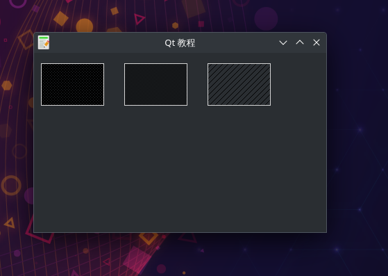

# 绘画QPainter-颜色QColor
- 颜色是一个对象代表红、绿、蓝(RGB)强度值。有效的RGB值的范围从0到255。
- 们可以用不同的方法定义了一个颜色。最常见的是RGB十进制或十六进制值的值。
- 我们也可以使用一个RGBA值代表红色,绿色,蓝色,透明度。我们添加一些额外的信息透明度。
- 透明度值255定义了完全不透明,0是完全透明的,例如颜色是无形的。
- 实例中我们绘制了3个不同颜色的矩形。

## 效果展示

