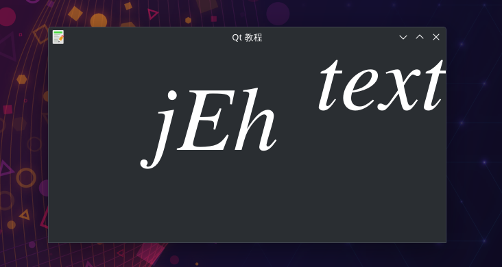

# 绘画QPainter-绘制文本1
- 在我们的示例中,我们绘制一些Cylliric文本。文本垂直和水平对齐。
- 相信大多 数人和我一样，刚开始的时候都认为 drawText() 的 x, y 是字符串左上角的坐标，其实不然，它是字符串的第一个字符的 origin 的坐标，y 是字体的 base line 的 y 坐标。
- 本案例窗口显示文本.
- 参考文章：https://blog.csdn.net/TemetNosce/article/details/78068520

## 绘图简介
Qt5绘画系统能够呈现矢量图形,图像,和大纲font-based文本。
我们也可以在程序中调用系统api自定义绘图控件。

绘图要在paintEvent()方法中实现。
在QPainter对象的begin()与end()方法间编写绘图代码。
它会在控件或其他图形设备上进行低级的图形绘制。

## 效果展示

