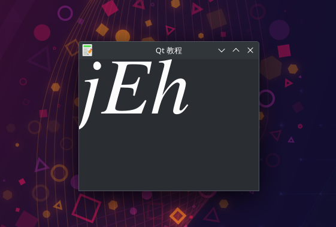

# 绘画QPainter-绘制文本1
- 我们先以窗体内Unicode文本的绘制为例。
- 在我们的示例中,我们绘制一些Cylliric文本。文本垂直和水平对齐。
- 还是原来的问题，从 widget 的左上角开始绘制文本，那么 y 就应该和 ascent 一样大，但是怎么得到 ascent 的值呢？难到需要我们记住每种字体的 ascent 的值吗？这也是一种方法，如果愿意，未尝不可，但是，脑子够用么，幸好 QFontMetrics 就能够给我们提供字体的信息，提供了很多函数，如取得 line height 用 height()，用 width() 计算字符串的宽度，ascent(), descent(), xHeight() 等, 函数的名字已经很好的表明它的作用，在此就不再一一介绍，更多的函数请参考 Qt 的帮助文档。所以为了达到我们的目的，只需要把 y = 0 修改为 int y = metrics.ascent() 就可以了：
- 原文链接：https://blog.csdn.net/TemetNosce/article/details/78068520

## 效果展示

