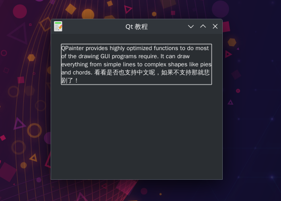

# 绘画QPainter-绘制换行文本
- 我们先以窗体内Unicode文本的绘制为例。
- 换行绘制文本
- 文本的包围矩形
- 一般显示的宽度应该是确定的，关键是高度的计算，可以逐个字符的把他们的宽度加起来（不同的字体每个字符的宽度不一样），当大于显示的宽度就换行，高度也对应的加上一行的高度，这样就能计算出最终的高度了，也就知道了显示消息的矩形大小，使用这个方法就能自适应的显示消息了。
- 虽然我们已经知道了自适应显示消息的原理，但是如果是我们自己来计算实现，难度还是不小的，其实 Qt 已经给我们提供了相关的 API，使用 QFontMetrics::boundingRect() 可以计算出包围文本的矩形，然后在用上面的方法绘制文本就可以了，下面的程序，改变窗口的宽度，能动态的计算出显示文本所有内容的包围矩形，解决了上面提到的在给定的矩形中，文本太长时显示不全的问题

## 效果展示

