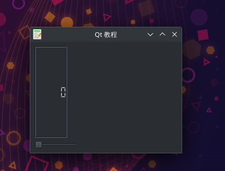

# 信号槽
- 这是一个使用信号槽的Qt5例子。
- 这个例子中展示了一个QtGui.QLCDNumber和QtGui.QSlider。lcd的值会随着滑块的拖动而改变。
- 在这里我们将滚动条的valueChanged信号连接到lcd的display插槽。
- sender 是发出信号的对象。receiver 是接收信号的对象。
- slot(插槽)是对信号做出反应的方法。

## 事件和信号介绍
### 事件 Event
- 所有的组件都是事件驱动的。
- 事件主要由用户触发，但也可能有其他触发方式：
- 例如网络连接、window manager或定时器。
- 当我们调用QApplication的exec_()方法时会使程序进入主循环。
- 主循环会获取并分发事件。

### 在事件模型中，有三个参与者：
- 事件源:事件源是状态发生变化的对象,它会生成事件。
- 事件对象:事件(对象)封装了事件源中状态的变动。
- 事件接收者:事件接收者是要通知的对象。事件源对象将事件处理的工作交给事件接收者。

## Qt信号槽
- Qt有一个独特的signal&slot(信号槽)机制来处理事件。
- 信号槽用于对象间的通信。
- signal在某一特定事件发生时被触发，slot可以是任何callable对象。
- 当signal触发时会调用与之相连的slot。

## 效果展示

