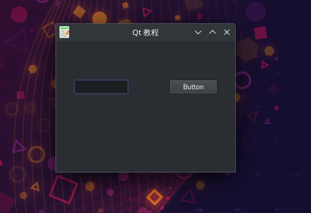

# 简单拖拽Drag
- 在之前示例中,我们有一个QLineEdit QPushButton。
- 我们拖着纯文本的行编辑窗口小部件,然后放到按钮部件。按钮的标签会改变。
- 这个列子演示了一个简单的拖拽操作

## 拖拽简介
在这部分Qt5教程中,我们将讨论拖拽相关操作。

在计算机图形用户界面中,拖放的操作(或支持的作用)点击虚拟对象和拖动到另一个位置或到另一个虚拟对象。一般来说,它可以用于调用多种行动,或创建各种类型的两个抽象对象之间的关联。

拖放是图形用户界面的一部分。拖拽操作让用户直观地做复杂的事情。

通常,我们可以拖放两件事:数据或一些图形对象。
如果我们把一个图像从一个应用程序到另一个地方,我们拖拽二进制数据。
如果我们把一个标签在Firefox中并将其移动到另一个地方,我们拖拽一个图形组件。

## 效果展示

