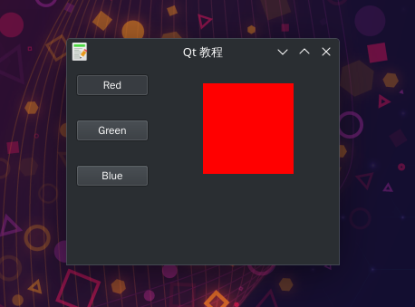

# 开关按钮ToggleButton
- ToggleButton是QPushButton的一种特殊模式。
- 它是一个有两种状态的按钮：按下与未按下。
- 通过点击在这两种状态间来回切换。这种功能在某些场景会很实用。
- 代码中我们创建了三个ToggleButton与一个QWidget。
- 我们将QWidget的背景色设为黑色。
- ToggleButton会切换颜色值中的红色、绿色与蓝色部分。
- QWidget的背景颜色依赖于按下的按钮。

## 效果展示
