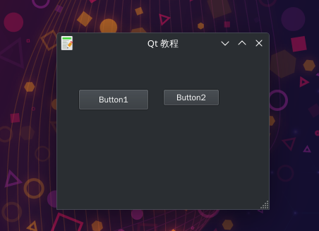

# 自定义按键事件处理器
- 有时需要知道信号是由哪个控件发出的。对此Qt5提供了sender()方法。
- 我们创建了两个按钮。
- 我们通过调用sender()方法来判断信号源， 并将其名称显示在窗体的状态栏中。
- 通过传入按钮对象进行判断


## qt编译
```
go mod vendor

GOWORK=off qtdeploy -fast test desktop
```

## 效果展示


